# **Data Sience Reading Sharing Platform**

**Xây dựng nền tảng chia sẻ nội dung thông minh hỗ trợ người dùng trao đổi và lan tỏa tri thức (DS Reading Sharing Platform)

---

## **1. THÔNG TIN NHÓM**

* Nguyễn Ngọc Lân – nguyenngoclan120904@gmail.com
* Ngô Trường Định - ngodinh2339@gmail.com
* Nguyễn Tấn Minh - minhnguyen10072004@gmail.com
* Phan Thành Đạt - thanhdat2022cltv@gmail.com

---

## **2. MÔ TẢ ĐỀ TÀI**

### **2.1. Mô tả tổng quan**

Trong thời đại bùng nổ thông tin, việc chia sẻ những bài viết hay, nguồn học liệu chất lượng là điều cần thiết. Tuy nhiên, các nền tảng hiện tại thường thiếu công cụ hỗ trợ cá nhân hóa nội dung hoặc hỗ trợ người dùng tóm tắt bài viết nhanh chóng.

Đề tài của chúng tôi là một nền tảng web mang tên **DS Reading Sharing Platform** – nơi người dùng có thể chia sẻ link bài viết, nhận tóm tắt nội dung và tương tác với chatbot hỗ trợ viết content. Web app này ứng dụng trí tuệ nhân tạo thông qua API của **Gemini** để hỗ trợ người dùng:

* Soạn nội dung dễ dàng.
* Tóm tắt các bài viết dài.
* Tự động đăng bài viết đã xử lý.
* Tương tác cơ bản như like, comment, lưu bài viết hay về kho lưu trữ,... cũng được thực hiện trên web app của chúng tôi.

Trang web còn hỗ trợ lưu trữ dữ liệu với PostgreSQL và Firebase, tích hợp Docker để đảm bảo khả năng triển khai dễ dàng trên **Google Cloud Platform** thông qua Cloud Run, Cloud SQL và hỗ trợ realtime nhờ Flask-SocketIO.

### **2.2. Mục tiêu**

* Xây dựng một nền tảng chia sẻ tri thức thân thiện, dễ sử dụng.
* Tích hợp AI hỗ trợ người dùng đọc nhanh, viết nhanh, chia sẻ nhanh.
* Ứng dụng công nghệ hiện đại như Docker, Cloud, Realtime, AI vào một sản phẩm hoàn chỉnh.

---

## **3. PHÂN TÍCH THIẾT KẾ**

### **3.1. Phân tích yêu cầu**

* **Chức năng**:

  * **Quản trị viên**:
    * Xem thống kê hệ thống (bài viết, người dùng, bài chờ duyệt)
    * **Quản lý người dùng**:
      * Cấp / thu hồi quyền admin
      * Khóa / mở khóa tài khoản qua Firebase
    * **Quản lý bài viết**:
      * Phê duyệt / từ chối bài viết
      * Xóa bài viết
  * **Xác thực người dùng**:
    * Đăng ký / đăng nhập với Firebase
    * Đăng xuất
    * Khôi phục mật khẩu
    * Xem hồ sơ người dùng
    * Chỉnh sửa thông tin cá nhân
    * Cập nhật / làm mới ảnh đại diện
    * Tải ảnh đại diện lên Firebase Storage
    * Tự động tạo avatar nếu chưa có
  * **Bài viết**:
    * Tạo bài viết mới (với ảnh, nội dung, liên kết, hashtag, chế độ hiển thị)
    * Xem bài viết chi tiết
    * Sửa bài viết của mình
    * Xóa bài viết của mình
    * Gắn thẻ, lưu trữ, phân quyền công khai/riêng tư
    * Quản lý bài viết đã đăng của chính mình
  * **Tìm kiếm**:
    * Tìm theo tiêu đề, nội dung, tác giả, hashtag
    * Kết quả tìm kiếm hiển thị bài viết, tác giả, hashtag, tương tác (like, save...)
  * **Tương tác**:
    * Like / Unlike bài viết
    * Bình luận bài viết
    * Lưu bài viết (Save / Unsave)
    * Hiển thị tổng số lượt like
    * Danh sách bài viết đã lưu
  * **Theo dõi**:
    * Follow / Unfollow người dùng
    * Danh sách người theo dõi / đang theo dõi
    * Tìm kiếm và mention người dùng đã follow trong comment
  * **Thông báo**:
    * Thông báo khi có người like, comment, hoặc đăng bài mới
    * Gửi thông báo realtime qua Socket.IO
  * **Trợ lý AI (Gemini ai)**:
    * Đề xuất tiêu đề cho bài viết
    * Gợi ý cấu trúc nội dung
    * Sinh tag phù hợp
    * Nâng cao nội dung
    * Tóm tắt nội dung
    * Trò chuyện tương tác với AI
* **Phi chức năng**:

  * Hệ thống phải xử lý nhanh, tối ưu trải nghiệm người dùng.
  * Bảo mật xác thực người dùng
  * Khả dụng luôn hoạt động 24/7
  * Khả năng mở rộng tốt (scalable) thông qua container hóa và Cloud Run.

### **3.2. Đặc tả yêu cầu**

* **3.2.1. Mục đích hệ thống**:

  Cung cấp nền tảng cho người dùng đăng tải, chia sẻ, tương tác và quản lý bài viết một cách dễ dàng. Hệ thống hỗ trợ xác thực bảo mật bằng Firebase, hỗ trợ gợi ý AI, quản trị người dùng và thông báo thời gian thực.
* **3.2.2. Phạm vi**:

  * Người dùng đăng ký, đăng nhập bằng Firebase
  * Viết bài, bình luận, like, lưu bài viết
  * Follow/Unfollow và tương tác cộng đồng
  * Quản lý người dùng và bài viết (Admin)
  * Thông báo thời gian thực
  * Gợi ý AI (tiêu đề, nội dung, tag...)
* **3.2.3. Chức năng**

  | Mã  | Chức năng                   | Mô tả                                                             |
  | ---- | ----------------------------- | ------------------------------------------------------------------- |
  | FR1  | Đăng ký / Đăng nhập     | Firebase Auth, kiểm tra UID                                        |
  | FR2  | Cập nhật hồ sơ            | Cập nhật tên, ảnh đại diện, số điện thoại, ngày sinh... |
  | FR3  | Tạo bài viết               | Viết bài, chèn ảnh, đặt quyền riêng tư                     |
  | FR4  | Chỉnh sửa / Xóa bài viết | Tác giả được sửa hoặc xóa bài của mình                   |
  | FR5  | Like / Bình luận            | Tương tác với bài viết                                        |
  | FR6  | Lưu bài viết               | Lưu / bỏ lưu các bài viết yêu thích                         |
  | FR7  | Follow người dùng          | Theo dõi / hủy theo dõi                                          |
  | FR8  | Tìm kiếm bài viết         | Theo tiêu đề, nội dung, hashtag, tác giả                      |
  | FR9  | Trợ lý AI                   | Sinh tiêu đề, tag, tóm tắt, cải thiện nội dung              |
  | FR10 | Gửi thông báo              | Gửi thông báo khi có like/comment/bài viết mới               |
  | FR11 | Đánh dấu đã đọc        | Đánh dấu thông báo đã đọc                                  |
  | FR12 | Quản trị người dùng      | Admin duyệt bài viết, cấp quyền, khóa tài khoản             |
  | FR13 | Quản trị bài viết         | Admin phê duyệt / từ chối / xóa bài                           |
  | FR14 | Giao tiếp socket             | Socket.IO gửi thông báo real-time                                |
* **3.2.4. Người dùng**

  | Vai trò               | Quyền                                                            |
  | ---------------------- | ----------------------------------------------------------------- |
  | Anonymous              | Xem bài viết công khai, đăng ký, đăng nhập               |
  | Người dùng thường | CRUD bài viết cá nhân, like/comment/save/follow, sử dụng AI |
  | Admin                  | Duyệt bài, quản lý người dùng                              |
  | Initial Admin          | Toàn quyền admin: cấp quyền, khóa user khác                 |
* **3.2.5. Phi chức năng**:

  | Loại                | Mô tả                                                            |
  | -------------------- | ------------------------------------------------------------------ |
  | Hiệu năng          | Hệ thống phản hồi trong vòng <1s với các thao tác cơ bản |
  | Bảo mật            | Xác thực Firebase, phân quyền rõ ràng                        |
  | Khả dụng           | Hệ thống online 24/7, backup định kỳ                          |
  | Khả năng mở rộng | Có thể tích hợp thêm AI khác, cloud storage, load balancing  |

### **3.3. Thiết kế hệ thống**

* **Use case diagram**:
  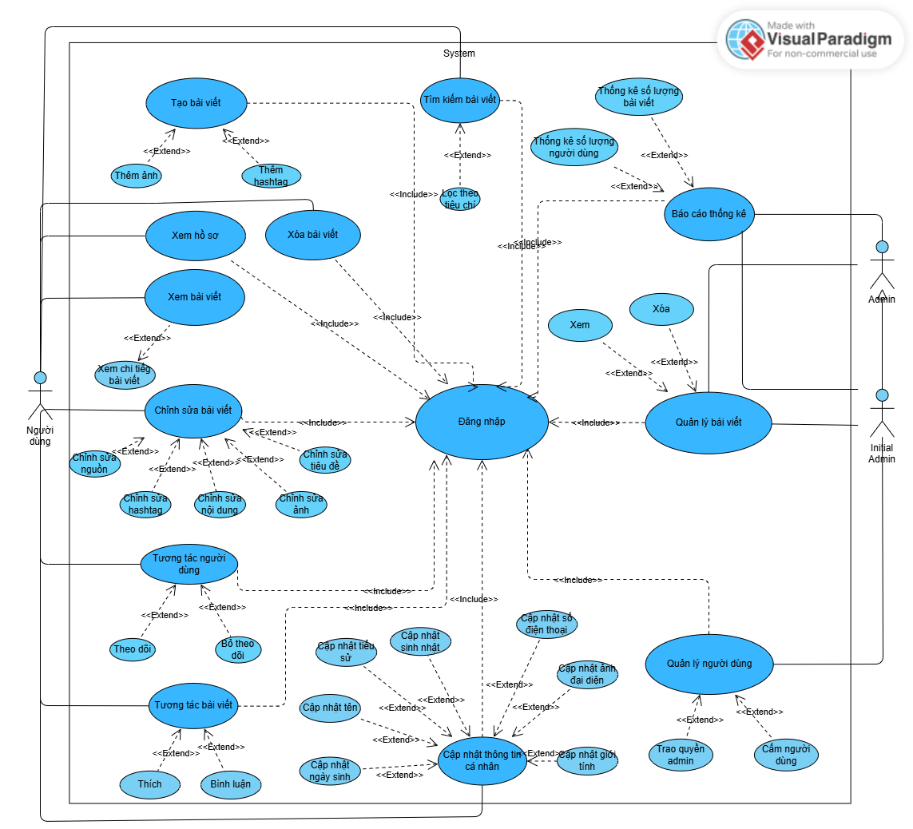
* **Thiết kế CSDL**:

  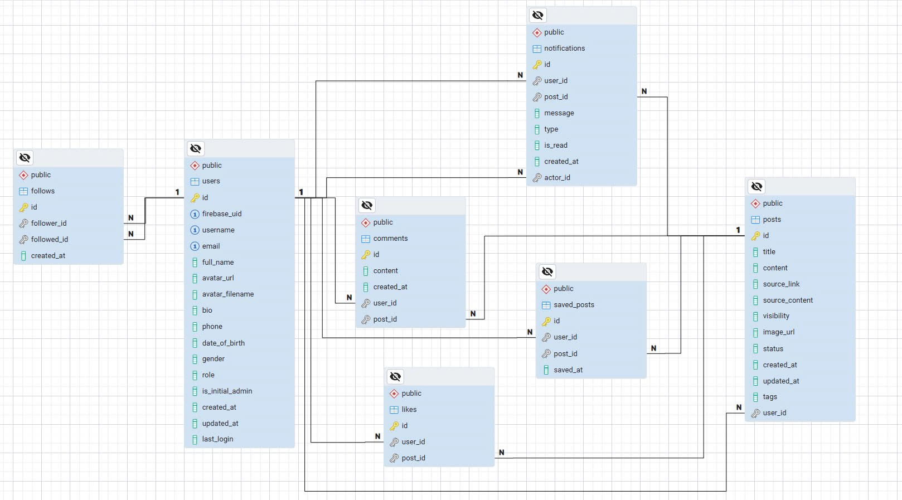
* **Thiết kế giao diện**:
  * **Giao diện trang chủ**:
    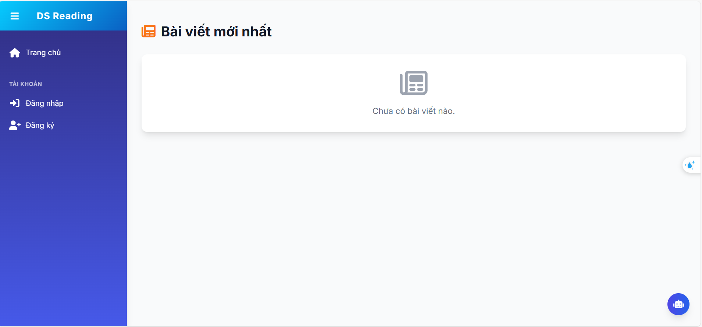
  * **Giao diện đăng nhập**:
    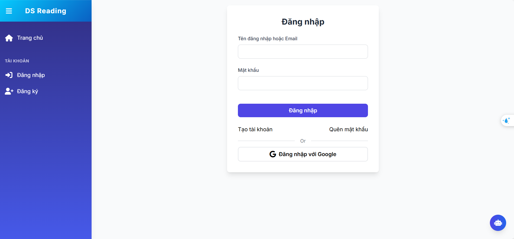
  * **Giao diện đang ký**:
    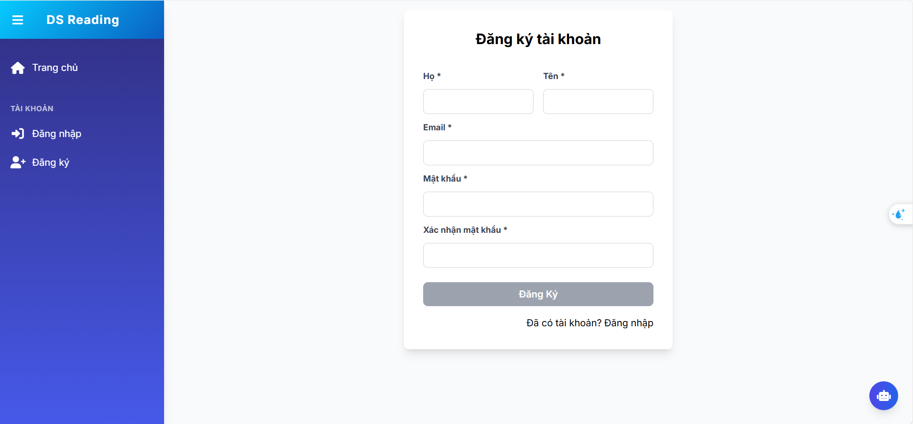
  * **Giao diện đăng bài viết**:
    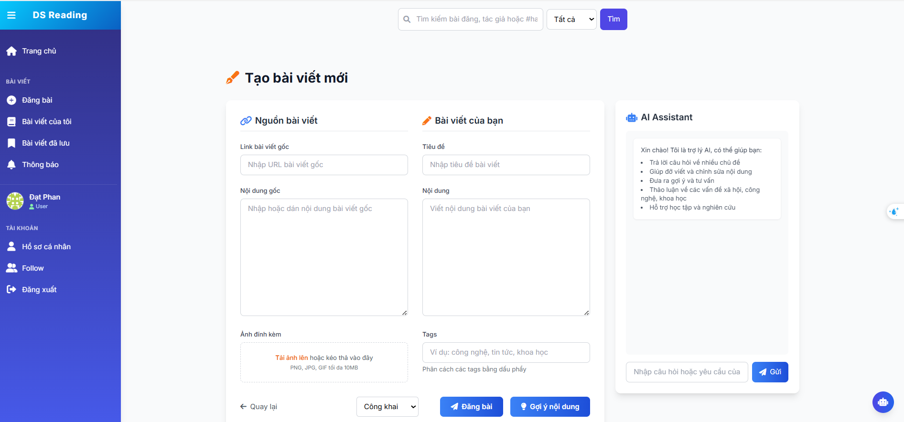
  * **Giao diện bài viết của bản thân**:
    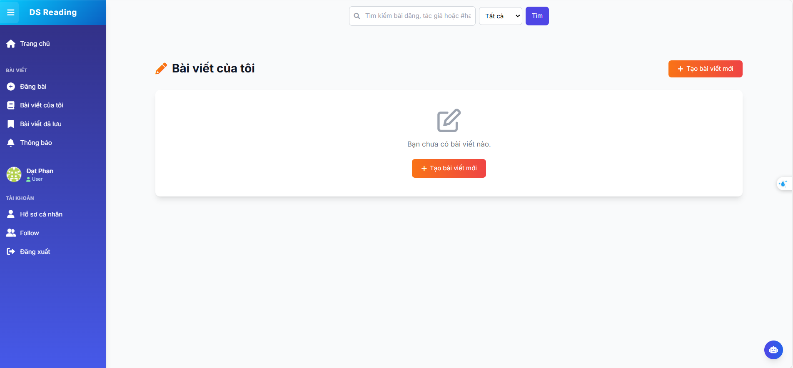
  * **Giao diện đăng bài viết đã lưu**:
    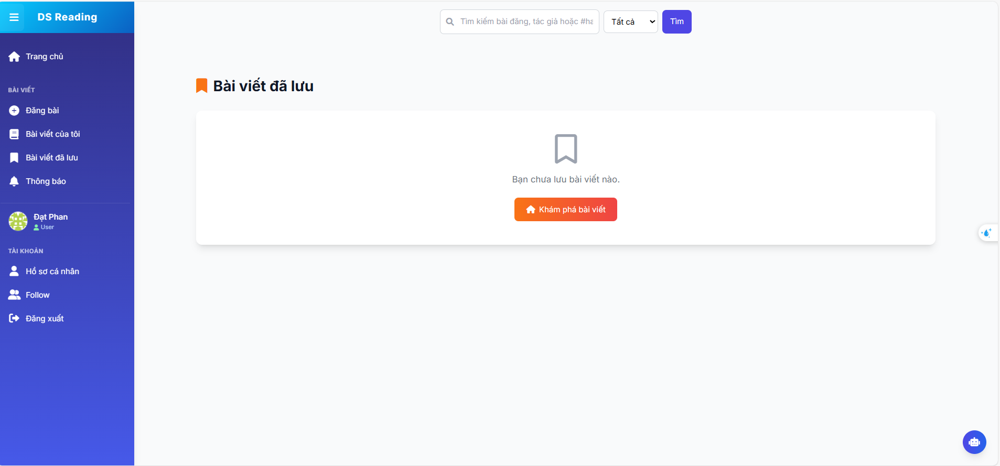
  * **Giao diện thông báo**:
    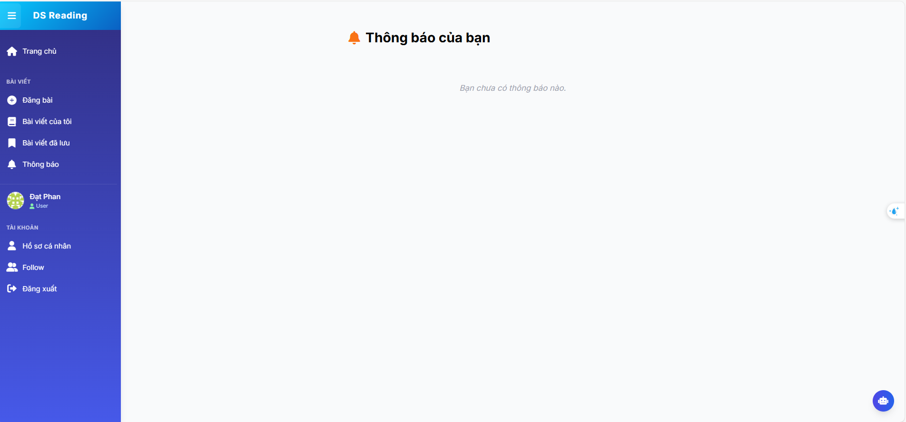
  * **Giao diện hồ sơ cá nhân**:
    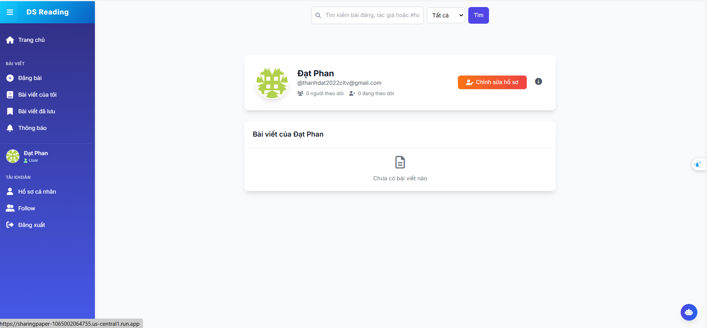
  * **Giao diện follow**:
    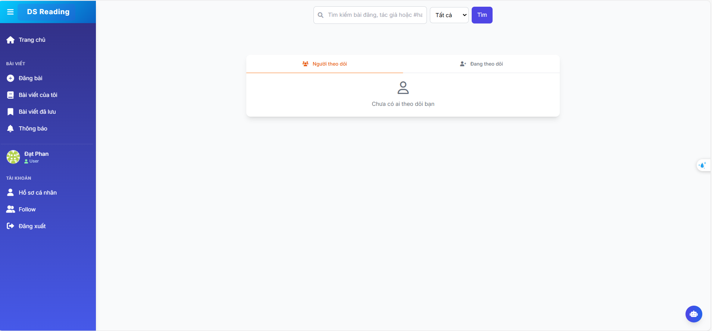
  * **Giao diện tìm kiếm**:
    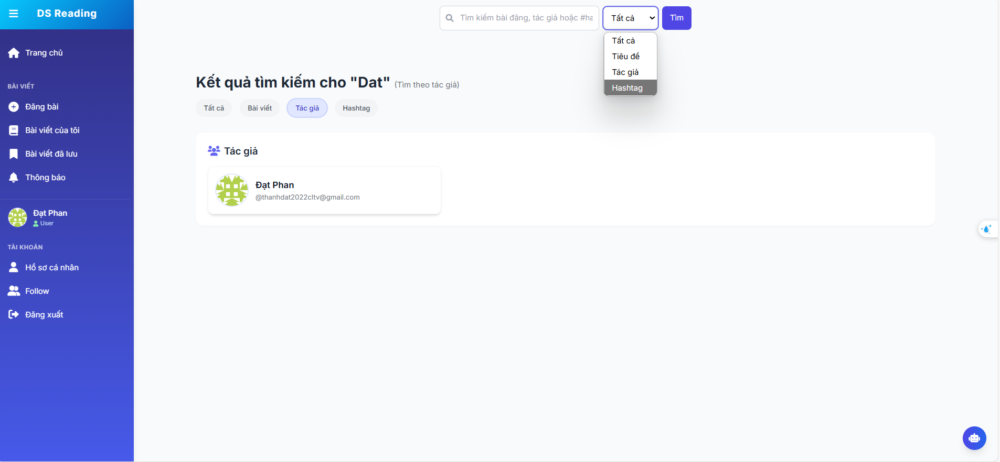 
---
 
## **4. CÔNG CỤ VÀ CÔNG NGHỆ SỬ DỤNG**

* **Ngôn ngữ lập trình**: Python, JavaScript
* **Backend**: Flask + Flask-SocketIO
* **Frontend**: HTML, TailwindCSS, JavaScript
* **AI API**: Gemini API (Google)
* **Cơ sở dữ liệu**: PostgreSQL + Firebase Realtime
* **IDE**: Visual Studio Code
* **Triển khai**: Docker, Google Cloud Platform (Cloud Run, Cloud SQL)

---

## **5. TRIỂN KHAI**

### **5.1. Quy trình xây dựng hệ thống**

1. Thiết kế frontend bằng HTML + Tailwind.
2. Xây dựng backend Flask: routing, gọi API, xử lý dữ liệu.
3. Tích hợp SocketIO để hỗ trợ tương tác realtime.
4. Dùng Docker để tạo image.
5. Deploy trên Google Cloud Platform:

   * Cloud Run (chạy container).
   * Cloud SQL (PostgreSQL).
   * Firebase (Auth + Realtime).

### **5.2. Hướng dẫn cài đặt và chạy web app**

#### **5.2.1. Yêu cầu hệ thống**

* Docker Desktop
* Git
* pgAdmin (tùy chọn - để quản lý database)

#### **5.2.2. Các bước cài đặt**

1️⃣ **Clone repository**

```bash
git clone https://github.com/iuh-application-development/DS-Reading-Sharing-Platform.git
cd DS-Reading-Sharing-Platform
```

<!-- 2️⃣ **Tạo file .env**
```bash
cp .env.example .env
``` -->

tôi đã cấu hình không loại bỏ .env nên không cần làm bước này

3️⃣ **Khởi động ứng dụng với Docker**

```bash
docker-compose up --build
```

4️⃣ **Truy cập ứng dụng**

* Web: http://localhost:5001
* Tài khoản admin mặc định:
  * Email: admin@admin.com
  * Password: admin123

### **5.2.3. Kết nối với pgAdmin**

1️⃣ **Mở pgAdmin**

2️⃣ **Tạo server mới**

* Click chuột phải vào Servers → Register → Server
* Trong tab General:

  * Name: DS Reading Platform (hoặc tên tùy chọn)
* Trong tab Connection:

  * Host name/address: localhost
  * Port: 5433
  * Maintenance database: ds_reading_db
  * Username: postgres
  * Password: wsunicorn

### **5.2.4. Cấu trúc Docker**

Ứng dụng sử dụng 2 container:

* **Web container**: Chạy Flask application
* **Database container**: Chạy PostgreSQL

Data được lưu trong Docker volumes:

* **postgres_data**: Lưu trữ database
* **uploads_data**: Lưu trữ files upload

### **5.2.5. Các lệnh Docker hữu ích**

```bash
# Khởi động ứng dụng
docker-compose up

# Chạy ứng dụng ở chế độ nền
docker-compose up -d

# Dừng ứng dụng
docker-compose down

# Xem logs
docker-compose logs

# Xem logs của service cụ thể
docker-compose logs web
docker-compose logs db

# Restart service
docker-compose restart web

# Xóa volumes (cẩn thận, sẽ mất data)
docker-compose down -v
```

### **5.2.6. Lưu ý quan trọng**

1️⃣ **Bảo mật**

* Thay đổi mật khẩu admin mặc định sau khi cài đặt
* Không chia sẻ file .env
* Đặt mật khẩu mạnh cho database trong môi trường production

2️⃣ **Backup**

* Database được lưu trong Docker volume
* Nên backup định kỳ trong môi trường production
* Có thể export/import data thông qua pgAdmin

3️⃣ **Troubleshooting**

* Nếu gặp lỗi port conflict, kiểm tra và đổi port trong docker-compose.yml
* Nếu không kết nối được database, kiểm tra thông tin trong .env
* Xem logs để debug khi có lỗi xảy ra

---

## **6. KIỂM THỬ**

* **Functional Testing**:

  * Kiểm tra từng chức năng: chia sẻ link, hiển thị tóm tắt, trò chuyện với chatbot,...
* **Performance Testing**:

  * Đo thời gian phản hồi khi gửi link.
  * Kiểm thử đồng thời nhiều người dùng tương tác với chatbot.

---

## **7. KẾT QUẢ**

### **7.1. Kết quả đạt được**

* Nền tảng chia sẻ nội dung hoạt động ổn định.
* Tích hợp thành công Gemini API cho các tác vụ viết và tóm tắt.
* Realtime tương tác chatbot bằng SocketIO hoạt động mượt.
* Hệ thống đã được container hóa và sẵn sàng cho triển khai trên Cloud.

### **7.2. Kết quả chưa đạt được**

* Chưa có hệ thống gợi ý nội dung theo sở thích người dùng.
* Tốc độ tóm tắt chưa tối ưu với bài viết rất dài.

### **7.3. Hướng phát triển**

* Bổ sung hệ thống gợi ý nội dung theo profile người dùng (machine learning).
* Thêm tính năng like, comment, share nội dung.
* Tối ưu chatbot để hiểu ngữ cảnh sâu hơn.
* Tạo mobile app (sử dụng Flutter hoặc React Native).

---

## **8. TÀI LIỆU THAM KHẢO**

* \[[https://flutter.dev](https://flutter.dev)]
* \[[https://dart.dev](https://dart.dev)]
* \[[https://flask.palletsprojects.com/](https://flask.palletsprojects.com/)]
* \[[https://cloud.google.com/run](https://cloud.google.com/run)]
* \[[https://cloud.google.com/sql](https://cloud.google.com/sql)]
* \[[https://firebase.google.com](https://firebase.google.com)]
* \[[https://ai.google.dev/gemini-api/docs](https://ai.google.dev/gemini-api/docs)]
* [TailwindCSS Documentation](https://tailwindcss.com/docs)

---

Nếu bạn cần mình vẽ sơ đồ **Use case diagram** hoặc hỗ trợ thiết kế database / frontend wireframe, chỉ cần hú là mình làm ngay!
